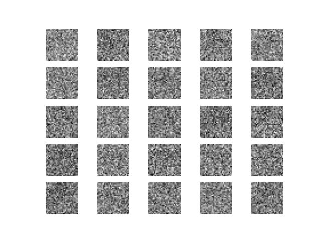

# SketchGAN

[Check out the article on Medium](https://medium.com/@edoardolanzini/can-a-computer-draw-6a3c397a16d7)

## Environment
Set up a new environment with the necessary dependencies:
```
# Create a new environment
conda create -n py37 python=3.7

# Activate the environment
conda activate py37

# Install dependencies from requirements.txt file
pip install -r requirements.txt
```

## Data
The Quick, Draw! dataset is publicly available and [here](https://github.com/googlecreativelab/quickdraw-dataset#get-the-data) you can find the instructions on how to download the data locally. The `load_data` module is available in order to handle the `.ndjson` drawing files.

Here is a quick step-by-step guide to download the data locally:

1. Download `gsutil` following the instructions [here](https://cloud.google.com/storage/docs/gsutil_install)

2. Find the [dataset on Google Cloud Console](https://console.cloud.google.com/storage/browser/quickdraw_dataset) and navigate to `/full/simplified/`

3. Browse all the different categories available and pick one

4. Run `gsutil -m cp gs://quickdraw_dataset/full/simplified/[category].ndjson [path-to-store]`

    For instance, the follwing command will download the `circle.ndjson` file in your current directory:

    `gsutil -m cp gs://quickdraw_dataset/full/simplified/circle.ndjson .`

Make sure the `.ndjson` file corresponding to the category is in your root folder.

## Model

GANs implementation in Keras, available [here](https://github.com/eriklindernoren/Keras-GAN/blob/master/gan/gan.py). 

Here you can see a summary of the architecture:

```
Model: "sequential_1"
_________________________________________________________________
Layer (type)                 Output Shape              Param #   
=================================================================
flatten_1 (Flatten)          (None, 784)               0         
_________________________________________________________________
dense_1 (Dense)              (None, 512)               401920    
_________________________________________________________________
leaky_re_lu_1 (LeakyReLU)    (None, 512)               0         
_________________________________________________________________
dense_2 (Dense)              (None, 256)               131328    
_________________________________________________________________
leaky_re_lu_2 (LeakyReLU)    (None, 256)               0         
_________________________________________________________________
dense_3 (Dense)              (None, 1)                 257       
=================================================================
Total params: 533,505
Trainable params: 533,505
Non-trainable params: 0
_________________________________________________________________
Model: "sequential_2"
_________________________________________________________________
Layer (type)                 Output Shape              Param #   
=================================================================
dense_4 (Dense)              (None, 256)               25856     
_________________________________________________________________
leaky_re_lu_3 (LeakyReLU)    (None, 256)               0         
_________________________________________________________________
batch_normalization_1 (Batch (None, 256)               1024      
_________________________________________________________________
dense_5 (Dense)              (None, 512)               131584    
_________________________________________________________________
leaky_re_lu_4 (LeakyReLU)    (None, 512)               0         
_________________________________________________________________
batch_normalization_2 (Batch (None, 512)               2048      
_________________________________________________________________
dense_6 (Dense)              (None, 1024)              525312    
_________________________________________________________________
leaky_re_lu_5 (LeakyReLU)    (None, 1024)              0         
_________________________________________________________________
batch_normalization_3 (Batch (None, 1024)              4096      
_________________________________________________________________
dense_7 (Dense)              (None, 784)               803600    
_________________________________________________________________
reshape_1 (Reshape)          (None, 28, 28, 1)         0         
=================================================================
Total params: 1,493,520
Trainable params: 1,489,936
Non-trainable params: 3,584
```

## Usage

```
python gan.py
```

## Results

### Circle


### Airplane


### Cat
